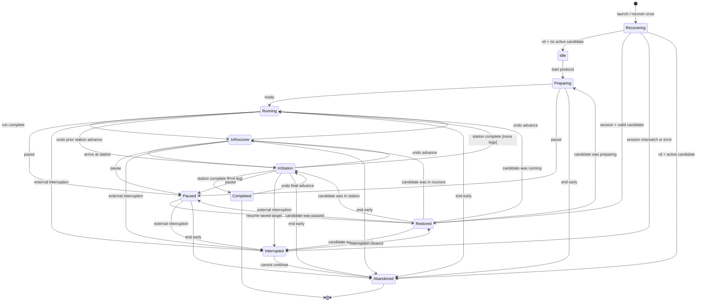

# HYROX workout state machine — version 1

## 1. Purpose and scope

This document defines version 1 of the HYROX workout state machine on paper, before implementation. It covers the full eight-run, eight-station race and the shortened two-run, two-station development protocol. A version 2 will follow after coding so that the design-to-implementation diff can be examined.

## 2. States

`stateStartedAt` is an absolute timestamp and is mandatory in every state, including non-workout and terminal states. No state stores an accumulating duration or tick count. This is a measured rule: without a workout session, tick counting lost 79.4% of elapsed time; with one active session it still lost about 1.2%. A duration is therefore derived when needed from timestamp subtraction, principally `now − stateStartedAt`, with any excluded pause or interruption intervals also derived from their timestamp pairs.

The common active-workout context is `workoutID`, `sessionStartDate`, `protocol` (`full` or `two-leg test`), and completed pause/interruption timestamp intervals. Identifiers shown below are in addition to that context. A “snapshot” means the complete state value, including its original `stateStartedAt`, identifiers, context and timestamp intervals.

| State | Meaning | Fields carried | Is an `HKWorkoutSession` active? |
|---|---|---|---|
| `Idle` | No workout is in progress; a new workout may be requested. | `stateStartedAt` | No |
| `Recovering` | The one launch-time decision is in progress, before normal construction can create a session. | `stateStartedAt`; `launchAttemptID`; `persistedCandidate` (the prior atomic envelope, if readable) | Not yet; the recovery result may supply one |
| `Preparing` | A workout session exists and the pre-start countdown or readiness step is running. | `stateStartedAt`; common active-workout context; `upcomingLegNumber = 1` | Yes |
| `Running` | The athlete is completing run leg `n`. | `stateStartedAt`; common active-workout context; `legNumber` | Yes |
| `InRoxzone` | The run has ended and the athlete is moving through the roxzone to its following station; roxzone time counts. | `stateStartedAt`; common active-workout context; `legNumber`; `stationIndex`; `stationName` | Yes |
| `InStation` | The athlete is completing the station following run leg `n`. | `stateStartedAt`; common active-workout context; `legNumber`; `stationIndex`; `stationName` | Yes |
| `Paused` | The user deliberately paused while an active semantic state was in progress. | `stateStartedAt` (pause start); common active-workout context; `resumeTarget` snapshot; completed exclusion intervals | Yes, in its paused state |
| `Interrupted` | Capture or interaction cannot proceed normally because the system, another app, or recovery failed. | `stateStartedAt` (interruption start); available active-workout context; `resumeTarget` snapshot if known; `reason`; completed exclusion intervals | Yes when a recovered or interrupted session is retained; otherwise no capture is possible |
| `Completed` | The final Wall Balls station, or the final configured test station, ended cleanly and the workout session was ended. | `stateStartedAt` (completion timestamp); common active-workout context; `finalStationIndex`; `finalStationName`; `sessionEndDate`; final segment boundaries | No |
| `Abandoned` | The workout ended before a clean protocol completion, including an explicit early end or an unrecoverable launch mismatch. | `stateStartedAt` (abandonment timestamp); available active-workout context; `lastSemanticState` snapshot; `reason`; `sessionEndDate` if one could be established | No |

The full protocol fixes station indices and names as follows: 1 SkiErg, 2 Sled Push, 3 Sled Pull, 4 Burpee Broad Jumps, 5 Rowing, 6 Farmers Carry, 7 Sandbag Lunges, 8 Wall Balls. The two-leg test uses indices 1–2 and the same ordering. In both protocols, run `n` precedes station `n`.

An active `HKWorkoutSession` is required for every form of capture. This is measured: without one, the watch app was silently suspended about eight seconds after the wrist dropped. Terminal and idle states therefore perform no capture, and an `Interrupted` state without a retained session cannot continue capture.

For persistence, segment boundaries should be serialisable as offsets from the recovered workout session's `startDate`; on hydration, `stateStartedAt` would be reconstructed as `sessionStartDate + offset`. This is a **proposal to be tested**, not a settled fact. Its purpose is to prevent the app's segment record and HealthKit's workout envelope from drifting apart while preserving the rule that every hydrated state carries a start timestamp.

## 3. Transitions

Every actual machine transition writes one atomic persistence envelope: the new current state, its complete timestamp-bearing context, and the bounded undo history. The intended write method is a temporary file followed by rename. Persisting on every transition, and the adequacy of this atomic-write method on the target platform, are **design assumptions not yet validated**. They are adopted because a partially written state file after a crash would be worse than the preceding intact state.

The “class” column makes the later count auditable. `O` means ordinary progression; `A` means the transition exists to handle a launch or awkward path. “Persist” below always means the complete envelope written atomically, not only the fields named in the cell.

| ID | Class | From state | Event or guard | To state | What must be persisted at that moment |
|---|---|---|---|---|---|
| O1 | O | `Idle` | User starts the full or two-leg protocol; session and builder start successfully | `Preparing` | New workout/session identifiers, `sessionStartDate`, protocol, `Preparing.stateStartedAt`, empty exclusions and empty undo history |
| O2 | O | `Preparing` | Countdown/readiness completes | `Running(leg 1)` | `Running.stateStartedAt`, leg 1 identity, session context; push the complete `Preparing` snapshot only if this event is user-correctable |
| O3 | O | `Running(n)` | User marks the 1 km run complete | `InRoxzone(n)` | Roxzone `stateStartedAt`, leg `n`, following station index/name; push the complete `Running(n)` snapshot to undo history |
| O4 | O | `InRoxzone(n)` | User marks arrival at station `n` | `InStation(n)` | Station `stateStartedAt`, leg/station identity; push the complete `InRoxzone(n)` snapshot |
| O5 | O | `InStation(n)` | Station complete and another configured leg remains | `Running(n + 1)` | Next run's `stateStartedAt` and leg identity; closed station boundary; push the complete `InStation(n)` snapshot |
| O6 | O | `InStation(final)` | Final configured station completes | `Completed` | Completion `stateStartedAt`, `sessionEndDate`, final boundary and summary context; push the complete final-station snapshot |
| A1 | A | Process entry | App launches | `Recovering` | `Recovering.stateStartedAt`, launch attempt ID, and the previously persisted envelope as `persistedCandidate`; no session object may have been created |
| A2 | A | `Recovering` | Recovery returns `nil` and there is no candidate claiming an active workout | `Idle` | `Idle.stateStartedAt`; recovery outcome; clear stale undo history |
| A3 | A | `Recovering` | Recovery returns `nil` but the candidate claims an active workout | `Abandoned` | Abandonment timestamp, candidate as `lastSemanticState`, reason `noRecoverableSession`, and the fact that no reliable session end is known |
| A4 | A | `Recovering` | Recovery returns a session and the candidate is valid and compatible | Candidate state restored | The retained recovered session identity/start date plus the exact candidate state, its original `stateStartedAt`, exclusions and undo history; do not replace its timestamp with relaunch time |
| A5 | A | `Recovering` | Recovery returns a session but semantic state is missing, corrupt or incompatible | `Interrupted` | Interruption timestamp, retained session context, reason, and all readable evidence; no station identity is invented |
| A6 | A | `Recovering` | Recovery returns any error | `Interrupted` | Interruption timestamp, error category and candidate; mark capture unavailable unless a session is already demonstrably retained; never retry recovery in this process |
| A7 | A | `Preparing`, `Running`, `InRoxzone` or `InStation` | User pauses | `Paused` | Pause-start timestamp in `Paused.stateStartedAt`, exact source snapshot as `resumeTarget`, existing exclusions and undo history |
| A8 | A | `Paused` | User resumes | `resumeTarget` state | Restore the target's original `stateStartedAt`; append the closed timestamp pair `[Paused.stateStartedAt, resumeAt]`; preserve identifiers and undo history |
| A9 | A | `Preparing`, `Running`, `InRoxzone` or `InStation` | System/phone/another app interrupts | `Interrupted` | Interruption-start timestamp, reason/source, exact source snapshot as `resumeTarget`, existing exclusions and history |
| A10 | A | `Paused` | System/phone/another app interrupts while paused | `Interrupted` | Interruption timestamp and reason; preserve the paused snapshot and its nested resume target without closing the user pause |
| A11 | A | `Interrupted` | Interruption ends and the session is still active | `resumeTarget` state | Restore the target's original `stateStartedAt`; append the closed interruption timestamp pair; preserve any still-open user pause and undo history |
| A12 | A | Any non-terminal workout state | Process dies or is force-quit | Process absent (external condition, not a persisted state) | Nothing can be written at death; the last successfully renamed envelope remains the recovery candidate |
| A13 | A | `InRoxzone(n)` | User invokes undo | Restored `Running(n)` | Pop and restore the complete prior snapshot, including its original timestamp, identifiers, exclusions and earlier bounded history |
| A14 | A | `InStation(n)` | User invokes undo | Restored `InRoxzone(n)` | Pop and restore the complete prior snapshot, including its original timestamp and station identity |
| A15 | A | `Running(n)`, where `n > 1` | User invokes undo of the preceding station-complete advance | Restored `InStation(n − 1)` | Pop and restore the complete preceding station snapshot and its timestamps |
| A16 | A | `Completed` | User invokes undo before the correction window closes | Restored `InStation(final)` | Pop and restore the final-station snapshot; persist that the workout envelope may already have ended and needs reconciliation before capture can resume |
| A17 | A | `Preparing`, `Running`, `InRoxzone` or `InStation` | User confirms “end workout early” | `Abandoned` | Abandonment timestamp, exact source snapshot, partial segment end, reason `userEndedEarly`, and session end date after ending the active session |
| A18 | A | `Paused` | User confirms “end workout early” | `Abandoned` | Abandonment timestamp, paused and resume-target snapshots, open pause closed by timestamps, reason and session end date |
| A19 | A | `Interrupted` | User abandons or recovery cannot safely continue | `Abandoned` | Abandonment timestamp, all available semantic/session evidence, reason and session end date if obtainable |
| A20 | A | `Preparing`, `Running`, `InRoxzone`, `InStation` or `Paused` | The workout session ends unexpectedly | `Interrupted` | Interruption timestamp, source snapshot, observed session state/end date and reason; stop all capture immediately |

No transition from an active workout to `Idle` is permitted. A workout must become either `Completed` or `Abandoned`, leaving an explicit record of how capture ended.

## 4. The awkward paths

### Launch-time recovery

`Recovering` is the entry decision on every launch. `recoverActiveWorkoutSession` must be called **exactly once**, before any screen, model, manager or other path can instantiate an `HKWorkoutSession`; the returned session must be retained. This strict order is measured, not defensive folklore: the API is not idempotent, and a second call fails against the first call's own session. An “endpoint already exists” error means that this process created or recovered a session before the launch decision. It is a programming-ordering bug and must not be retried around.

The outcomes are deliberately asymmetric:

- `nil` plus no active semantic candidate enters `Idle`. `nil` plus a candidate that claims an active workout enters `Abandoned`, because there is no active session and therefore no lawful way to continue capture.
- A returned session is retained. A compatible candidate is restored exactly, including its original state timestamp. Missing or incompatible semantic state enters `Interrupted`; the app must not guess which station was active.
- An error enters `Interrupted`, records the evidence, and is not retried during that process. The endpoint-conflict case is surfaced as a programming fault.

### Pause and resume

Pause time is represented by timestamps, never an accumulated pause duration. `Paused.stateStartedAt` is the pause-start timestamp and `resumeTarget` is the complete pre-pause snapshot. On resume, the machine restores the target's original `stateStartedAt` and appends `[pauseStartedAt, resumeAt]` to its exclusion intervals. If an adjusted active duration is required, it is computed at read time from the state's start timestamp and the differences between interval endpoints; no counter is incremented and no duration total is stored.

### Interruption by a phone call or another app

A system interruption moves the machine to `Interrupted` while retaining the existing workout session where the platform permits. The source snapshot and interruption-start timestamp are preserved. When the interruption clears, the source state and its original timestamp return, with a closed interruption interval added. If the session has ended, capture stops immediately because measured behaviour shows that capture without an active session is silently suspended; the user may only abandon or follow a separately validated reconciliation path.

### App death mid-station

Process death is not an event the dead process can persist. The design therefore relies on the last atomic envelope, written when `InStation` was entered or at a later pause/interruption transition. On relaunch, recovery runs first. If HealthKit returns the active session and the envelope is valid, the app reconstructs the station index/name, the original station start timestamp, session start, exclusion intervals and undo history. Elapsed station time is then recomputed from timestamps. Work performed after station entry is not lost merely because no ticks ran; however, an unpersisted user action at the instant of death cannot be reconstructed.

Atomic persistence on every transition is still a **design assumption awaiting experiment**. The temp-file-then-rename scheme must be killed at each write phase to establish whether the previous or new complete envelope always survives.

### Accidental advance (mis-tap)

Undo cannot be implemented from the current state alone. Each user-driven advance stores a complete snapshot of the state being left in a bounded LIFO `undoHistory` inside the same atomic envelope. A snapshot includes the state kind, original `stateStartedAt`, leg/station identity, session context, pause/interruption timestamp intervals and the earlier bounded history metadata. Undo pops and restores that value rather than constructing a similar-looking state with a new timestamp.

Version 1 sets the bound to the two most recent user-driven advances. This covers an immediate mis-tap and one compound correction without turning the persistence file into an unbounded event log. Pause, interruption and launch recovery do not consume history entries. History expires when the correction window closes or the user confirms the result. Undo from `Completed` is semantically possible, but because the workout session may already have ended it enters a reconciliation condition before capture can resume; restoration of semantic timestamps alone cannot reactivate HealthKit.

### Ending mid-station rather than at a clean boundary

An explicit early end from a run, roxzone or station becomes `Abandoned`, not `Completed`. The source snapshot is retained, the partial segment receives an end timestamp, and the workout session is ended. This preserves truthful partial data without implying that the configured protocol was completed. The same rule applies from `Preparing`, `Paused` and `Interrupted`, with all open exclusion intervals closed by timestamps where possible.

## 5. Explicit count

The count is by concrete state kind and by row in the transition table. The external “process absent” condition in A12 is not counted as a state. A transition row with several listed source states counts once because it expresses one rule and one persisted result shape.

| Category | State kinds | Transition rules |
|---|---:|---:|
| Ordinary progression | 6 (`Idle`, `Preparing`, `Running`, `InRoxzone`, `InStation`, `Completed`) | 6 (O1–O6) |
| Awkward paths only | 4 (`Recovering`, `Paused`, `Interrupted`, `Abandoned`) | 20 (A1–A20) |
| Total | 10 | 26 |
| Awkward : ordinary ratio | 4 : 6 = 0.67 : 1 | 20 : 6 = 3.33 : 1 |

The prediction is mixed rather than simply true or false. Awkward paths do **not** outnumber the happy path by state kind, but their transition rules do, by more than three to one. The latter supports the prediction that correction and recovery logic will be larger, while the former prevents that conclusion being smuggled into the state count.

## 6. State diagram

The diagram uses one generic leg/station pair. Guards select either the next run or completion; recovery restoration may target whichever semantic state was persisted.

## 7. Open questions

- Does temp-file-then-rename persistence always leave either the old or new complete envelope when the app is killed during each write phase?
- Can station and exclusion boundaries be persisted as offsets from the recovered session's `startDate` and round-trip without measurable drift or precision loss?
- When a phone call or another app interrupts the watch, which session callbacks and states occur, and does capture remain active throughout?
- Can a session that has already ended be resumed after undoing `Completed`, or must that correction remain semantic-only?
- Is a two-entry undo history sufficient in observed workouts, and when should its correction window expire?
- What should the user see when recovery returns an active session but the semantic envelope is missing or corrupt: guided reconstruction, abandonment, or a read-only partial record?
- If recovery returns `nil` while persisted semantic state claims an active workout, can HealthKit provide an authoritative end timestamp, or must the record retain an unknown end?
- Does the selected workout activity category affect session longevity, energy estimates or interruption behaviour during a full-length race?
- What is the battery cost of retaining an active session for a typical 90-minute HYROX workout?
